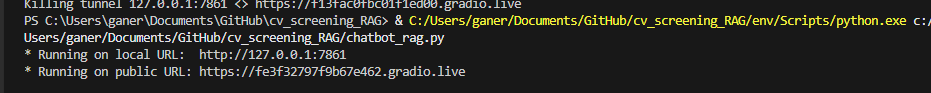
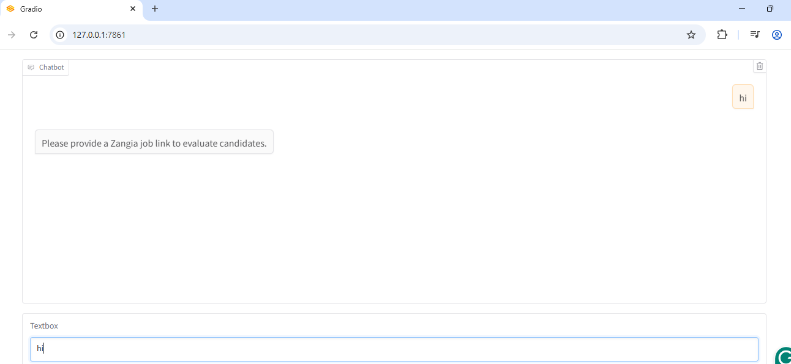

# CV Screening RAG

Энэхүү төсөл нь **RAG (Retrieval-Augmented Generation)** аргачлалыг ашиглан ажил горилогчдын CV-г сонгон шалгаруулахад туслах зорилготой. Систем нь олон CV-г уншиж, тухайн ажилд тавигдсан шаардлагуудтай харьцуулан үнэлгээ өгнө.

## ⚙️ Технологийн стек
- **Backend:** Python, FastAPI, LangChain 
- **Frontend:** Gradio
- **Embeddings:** HuggingFace all-MiniLM-L6-v2
- **Өгөгдөл хадгалалт:** Local (`data` хавтасанд CV хадгална)  
- **LLM:** HuggingFace OpenAI-Compatible API (gpt-oss-20b)

## 📂 Төслийн бүтэц

├── data/              # CV PDF-үүдийг байрлуулах хавтас
├── chroma_db/         # ChromaDB хадгалах сан
├── app.py             # Гол код (Gradio UI болон логик)
├── .env               # HuggingFace API түлхүүр (HF_KEY)
└── README.md

## Суулгах заавар
1. Репо-г татах
```
git clone <repo-url>
cd <repo-folder>
```

2. Орчныг идэвхжүүлэх
```
python -m venv env
source env/bin/activate   # Linux/Mac
env\Scripts\activate      # Windows
```

3. Шаардлагатай сангуудыг суулгах
```
pip install -r requirements.txt
```

4. HuggingFace API түлхүүрээ .env файлд хийх
```
HF_KEY=your_huggingface_api_key
```
## Хэрхэн ажиллуулах вэ?
- 1. CV PDF-үүдээ data/ хавтас руу хуулна.
- 2. Gradio аппыг ажиллуулах
```
python chatbot_rag.py
```
- 3. Локал дээр дараах линк гарна: http://127.0.0.1:7860 (default port)



- 4. Чат цонхонд Zangia.mn ажлын зарын линк оруулснаар тухайн ажилд тохирох CV-үүдийн дүгнэлт гарна.

## Үндсэн боломжууд
- CV болон ажлын зарын текстийг хэсэгчлэн салгаж, эмбеддинг вектор болгон хадгалах
- LLM ашиглан CV бүрийг оноогоор дүгнэх
- Gradio дээр интерактив чатбот байдлаар ашиглах

## Дэлгэцийн агшин

